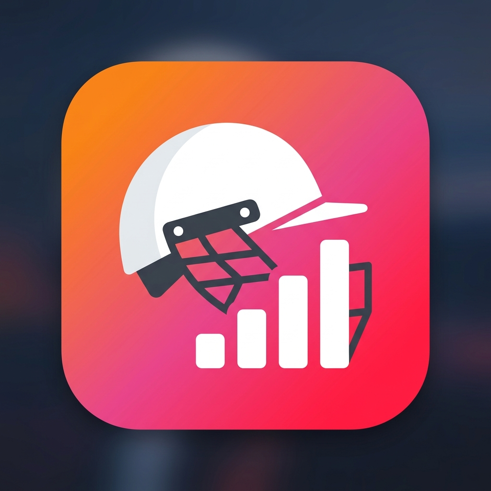

<div align="center">
  
  <h1>🏏 Cricklytics: The Next-Gen Cricket Analytics Engine</h1>
  <p><i>Smart Insights · AI Commentary · Data Driven · Premium UI</i></p>
  <p><b>Built by Aayush Tripathi — Cricketer turned Developer</b></p>
</div>

---

## 📸 Project Showcase (Screenshots)

> **Note to Aayush:** *Drop your screenshots in a `docs/` folder and replace these placeholder links!*
* **Home Dashboard & 3D CSS:** ``
* **Match Story Mode:** ``
* **Player DNA Radar:** ``
* **AI Commentator & ML Predictor:** ``

---

## 🎯 The Vision & Goal

**Cricklytics** was born out of a dual passion: a deep love for cricket and a fascination with data science. The goal was to build more than just a spreadsheet of statistics. I wanted to create a **premium, Apple TV-like analytical dashboard** that makes exploring 18 seasons (and 278,000+ deliveries) of IPL data feel cinematic, interactive, and intelligent. 

The objective was to bridge the gap between raw CSV files and human understanding by injecting **Machine Learning, AI, and advanced 3D visual design** into the experience.

## ✨ Standout Features

### 1. 🎬 Match Story Mode
Pick any historical match and watch a cinematic timeline of the win probability shifting ball-by-ball. The system auto-detects key moments (wickets, momentum swings) and generates an AI match summary.

### 2. 🧬 Player DNA Radar
A deeply analytical spider chart for every player, ranking them from 0-100 across 5 custom dimensions (Powerplay Aggression, Death Over Dominance, Strike Rotation, Boundary Frequency, Consistency).

### 3. ⚡ Clutch Factor Engine
Not all runs are equal. This algorithm dynamically recalculates a player's Strike Rate and average based on **game pressure** (chasing high totals, losing early wickets) to find the true "Clutch" players.

### 4. 🎙️ AI Commentator & 🤖 ML Predictor
- Uses Machine Learning models (Random Forest/XGBoost) to predict match outcomes and exact scores based on live match states.
- Generates human-like, dynamic commentary for predicted or historical match situations using an AI text-generation engine.

### 5. 🧊 Zero-Lag 3D Glassmorphism UI
The UI is built with a custom-engineered CSS/JS injection system inside Streamlit. It features:
- **3D Tilt Cards:** Hardware-accelerated CSS perspective transforms that physically tilt cards as you hover.
- **Scroll-Linked Physics:** Elements that dynamically react and move based on your physical scroll wheel without slowing down the Python backend.

---

## 🛠️ How I Built It (Tech Stack)

Building a high-performance web app that parses a 70MB+ dataset instantly required careful architectural choices:

* **Frontend:** Streamlit (Python), but heavily customized with injected HTML, CSS, and vanilla JavaScript to bypass default UI limitations and achieve a 60fps 3D aesthetic.
* **Backend Data Engine:** Pandas & NumPy for vectorized, instant calculations across 278,000 rows of ball-by-ball data.
* **Data Visualization:** Plotly (for interactive, zoomable radars, scatters, and line charts).
* **Machine Learning:** Scikit-learn for the prediction pipelines.

---

## 🚀 How to Run Locally

If you want to spin up Cricklytics on your own machine:

1. Clone the repository:
   ```bash
   git clone https://github.com/aayusht1711/Cricklytics.git
   cd Cricklytics
   ```
2. Install the required dependencies:
   ```bash
   pip install -r requirements.txt
   ```
3. Run the Streamlit Engine:
   ```bash
   streamlit run app.py
   ```
4. Open your browser to `http://localhost:8501`.

---

## 📬 Let's Connect
> *Aayush, you can add your LinkedIn, Twitter, or Portfolio links here!*
* **LinkedIn:** [Your LinkedIn URL]
* **GitHub:** [@aayusht1711](https://github.com/aayusht1711)
